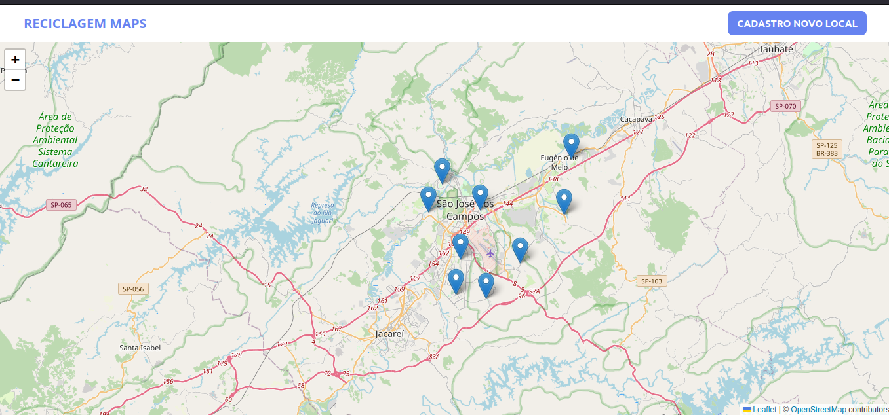
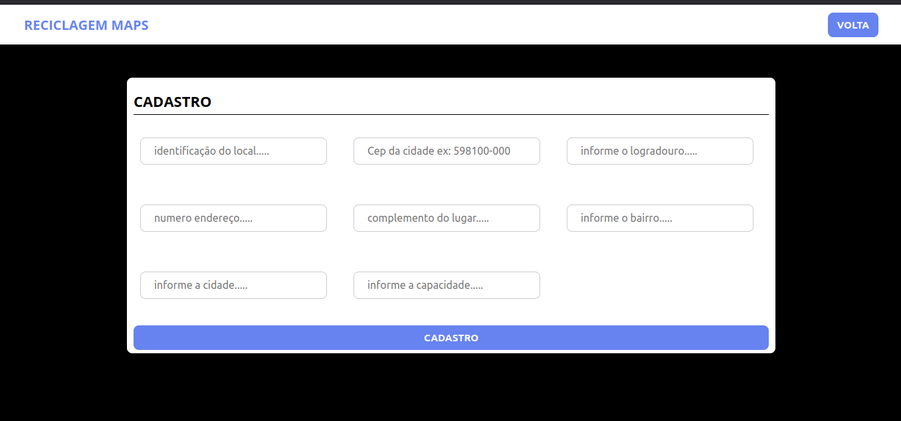

# Desafio CSJsistemas

> Nesse desafio o objetivo era a parte de desenvolvimento onde a aplicação consistia em adicionar novos locais de reciclagem, editar e atualizar dados desses locais. Além disso, marcando com Marker que conteria a latitude e logitude.

> O grande desafio foi acha um api que fornecesse a latitude e logitude com algumas palavaras chaves, uma solução foi o Api do google maps para fornece isso.

[Documetação de como usar essa API](https://developers.google.com/maps/documentation/geocoding/overview)

## Images do Projeto

### Pagina inicial

### Pontos informações dos pontos

### Cadastro Novo Local
